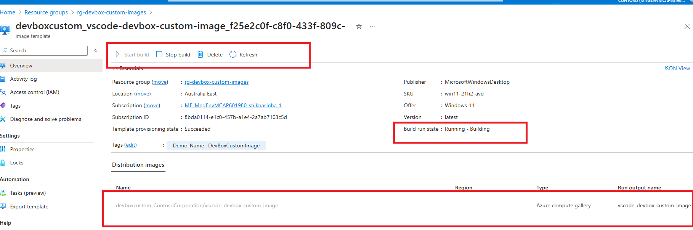
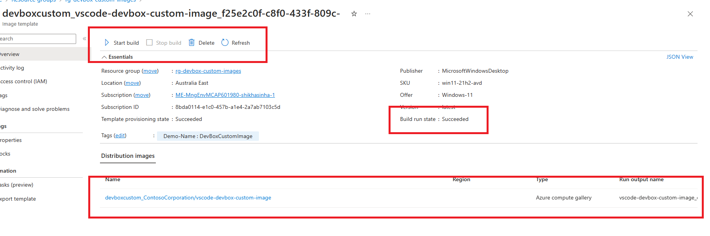

## Microsoft Dev Box Quickstart

- [What is Microsoft Dev Box?](https://learn.microsoft.com/en-us/azure/dev-box/overview-what-is-microsoft-dev-box)
- [DevBox QuickStart](https://github.com/luxu-ms/Devbox-ADE-Infra/tree/main)

# Custom DevBox Image

## Requirements

- Install the AZ CLI tool
- Connect to your Azure tenant using `az login`
- Connect to the appropriate subscription `az account set --subscription $subscriptionID`
- User who has logged in into Azure should have Owner permission as the demo assigns an RBAC role to a managed identity
- Ensure that the correct resource providers are enabled on the subscription [resource provider docs](https://learn.microsoft.com/en-us/azure/dev-box/how-to-customize-devbox-azure-image-builder#create-a-windows-image-and-distribute-it-to-azure-compute-gallery)

## Clone the repository

```bash
git clone https://github.com/shksin/devbox-custom-image
```


## Custom Image Changes

The scripts that Azure Image Builder will use to build the image template for DevBox are in the `imageBuilderScripts` directory.
- **vscode-developer.ps1:** A sample script to deploy tools for frontend developers like vscode, github, node etc. This script is passed through to the `deploy.bicep` script and used in the `developerImage` module.

## Create Custom Image for DevBox Definition

1. Create a resource group in Azure to store the custom image resources in. Change the values of the variables below to suit your environment.
    ```RG_NAME=rg-devbox-custom-images```
    ```LOCATION=australiaeast```
    ```az group create --name $RG_NAME --location $LOCATION```

1. Update the parameters in the `deploy.bicep` file to match your environment.
1. Run the following command to deploy the resources: `az deployment group create --name devboxpoc --resource-group $RG_NAME --template-file deploy.bicep`. 

    Navigate to the `Image Template` created and check the status of the image build. <br>
     <br>

     Once the image build is complete, the status should update to succeeded.<br>
     


    <br> **Note:** The Image build process is slow and can take upto 30 minutes.

## What will be deployed as part of this repository

The code in this repository will create the following resources in Azure:

- **Azure Compute Gallery:** A gallery for Virtual Machine images to be stored and distributed for consumption.
- **VM Image Definition:** The Image definitions that are versioned and publish to the Compute Gallery.
- **Image Template:** Azure Image Builder template used to create a Virtual Machine image that can be used by DevBox.
- **Deployment Script:** Triggers the `image template build` to create a new image.
- **Managed Identity:** The identity used by the Virtual Machine Image definition to spin-up a Virtual Machine, Virtual Network and create an image.


## Assign Custom Image to DevBox Definition

1. Add the compute gallery to your DevBox instance.
1. Then add the new image to a dev box definition. <br> **Note:** The validation process can take 15 minutes. <br>

1. Test the new custom image.

