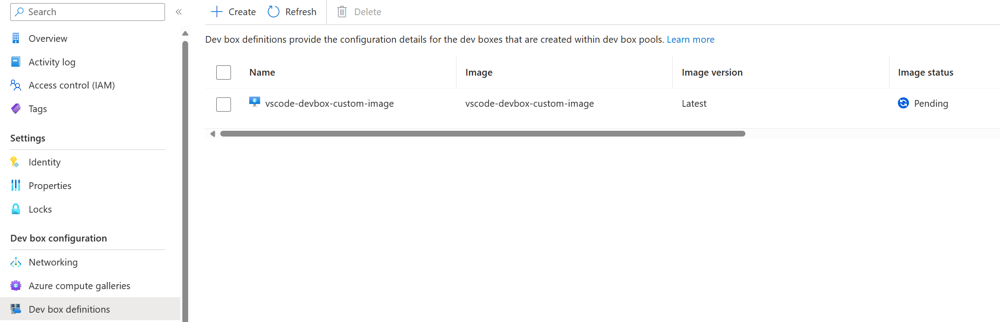
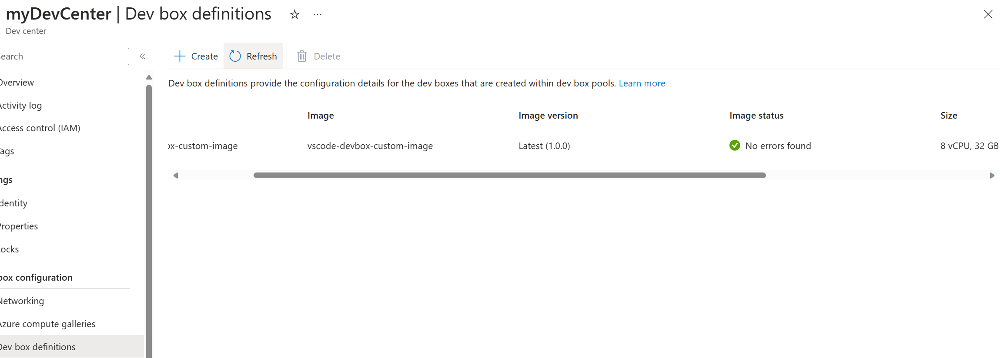

## Microsoft Dev Box Quickstart

- [What is Microsoft Dev Box?](https://learn.microsoft.com/en-us/azure/dev-box/overview-what-is-microsoft-dev-box)
- [DevBox QuickStart](https://github.com/luxu-ms/Devbox-ADE-Infra/tree/main)

# Custom DevBox Image

## Requirements

- Install the AZ CLI tool
- Connect to your Azure tenant using `az login`
- Connect to the appropriate subscription `az account set --subscription $subscriptionID`
- User who has logged in into az cli should have Owner permission as this demo assigns an RBAC role to a managed identity
- Ensure that the correct resource providers are enabled on the subscription [resource provider docs](https://learn.microsoft.com/en-us/azure/dev-box/how-to-customize-devbox-azure-image-builder#create-a-windows-image-and-distribute-it-to-azure-compute-gallery)

## Clone the repository

```bash
git clone https://github.com/shksin/devbox-custom-image
```

## Deploying Azure Resources
Create following variables. Change the values of the variables below to suit your environment.
```bash
# Resource Group for Dev Center
RG_DC=rg-devcenter1610
LOCATION=australiaeast

# DevCenter Name and Project Team Name
devCenterName=myDevCenter1610
projectTeamName=frontend-team
devCenterManagedIdName=id-${devCenterName}

# Compute Gallery Name, Image Name and Image Publisher
computeGalleryName=myOrgDevBoxGallery1610
imageName=vscode-devbox-custom-image1610
imagePublisher=myOrganisation # update to your organisation name

#DevBox Definition Storage and SKU
storage=ssd_256gb  # minumim storage, update if needed. Acceptable values : 'ssd_256gb', 'ssd_512gb', 'ssd_1024gb'
imageSku=general_i_8c32gb256ssd_v2 # general instance 8core 32gb ram 256gb ssd - This is minumim SKU, update if needed
```

## 1. Create Dev Center

Create a resource group in Azure for Microsoft Dev Box Dev Center. 
```bash

#Get the deploying users id for RBAC assignments
DEPLOYINGUSERID=$(az ad signed-in-user show --query id -o tsv)

#Create resource group
az group create -n $RG_DC -l $LOCATION

#Create devcenter common components
az deployment group create -g $RG_DC -f modules/devCenter.bicep -p devCenterName=$devCenterName projectTeamName=$projectTeamName devboxProjectAdmin=$DEPLOYINGUSERID devCenterManagedIdName=$devCenterManagedIdName
```

Following resources are created in Dev Center resource group:
- **Dev center:** A collection of Projects that require similar settings. 
- **Project:**  Represents a team or  or business function within the organization.
- **DevBoxProjectAdmin:** The user who is responsible for managing the project. 
- **Managed Identity:** The identity used by Dev Center to use Custom Images and create DevBox Definitions.

## Custom Image Build

The scripts that Azure Image Builder will use to build the image template for DevBox are in the `imageBuilderScripts` directory.
- **vscode-developer.ps1:** A sample script to deploy tools for frontend developers like vscode, github, node etc. 


## 2. Create Custom Image for DevBox Definition


```bash
#Create custom image for VS Code with Node and Git
az deployment group create -g $RG_DC -f modules/customImage.bicep  -p computeGalleryName=$computeGalleryName imageName=$imageName imagePublisher=$imagePublisher devCenterName=$devCenterName devCenterManagedIdName=$devCenterManagedIdName
```

<br> **Note:** The Image build process is slow and can take upto 30-45 minutes. <br>
Navigate to the `Image Template` created and check the status of the image build. <br>
     <br>

Once the image build is complete, the status should update to succeeded.<br>
     


Following resources are created in Custom Image resource group:
- **Azure Compute Gallery:** A gallery for Virtual Machine images to be stored and distributed for consumption.
- **VM Image Definition:** The Image definitions that are versioned and publish to the Compute Gallery.
- **Image Template:** Azure Image Builder template used to create a Virtual Machine image that can be used by DevBox.
- **Deployment Script:** Triggers the `image template build` to create a new image.


## 3. Attach Compute Gallery to Dev Center and ceate DevBox Definition in the Dev Center from the Image Build Created
**Note:** Run this step only when Custom Image Build has succeeded in Step 2 above. <br>

```bash
az deployment group create -g $RG_DC -f modules/customImage-devboxdef.bicep  -p devCenterName=$devCenterName computeGalleryName=$computeGalleryName imageName=$imageName storage=$storage imageSku=$imageSku
```
<br> **Note:** DevBox Definitions are validated when created and it can take upto 20-30 minutes for validation to succeed . <br>
Navigate to the `Dev Box definitions` menu on left and the status should show as `Pending`. <br>
     <br>

After validation is succeeded<br>
     


## 4. Deploy DevBox Infrastructure
A fully working Dev Box requires a lot of connected components. The bicep IaC included in this repository will help expedite the creation of a functioning Dev Box environment.

```bash
az deployment group create -g $RG_DC -f modules/devbox.bicep  -p devCenterName=$devCenterName projectTeamName=$projectTeamName devboxDefinitionName=$imageName
```