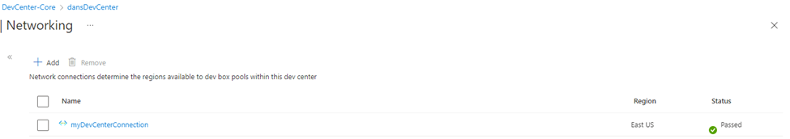
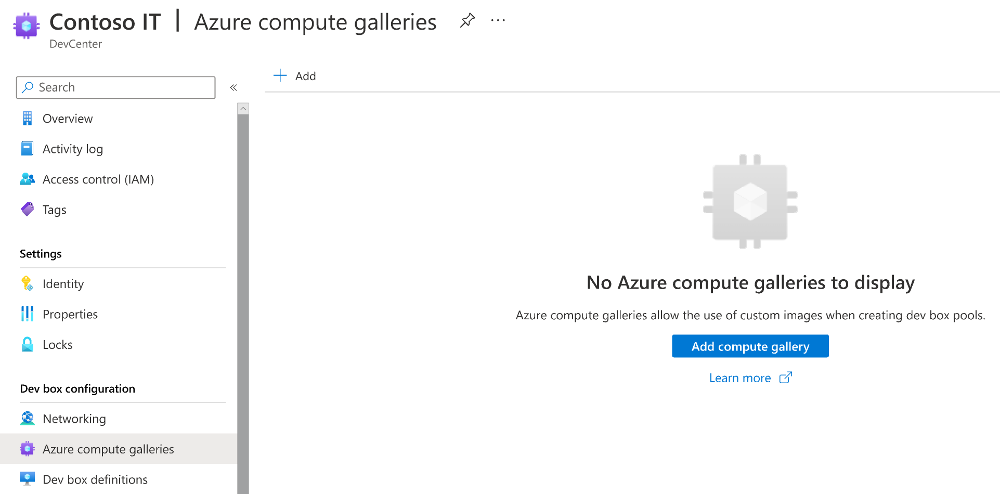
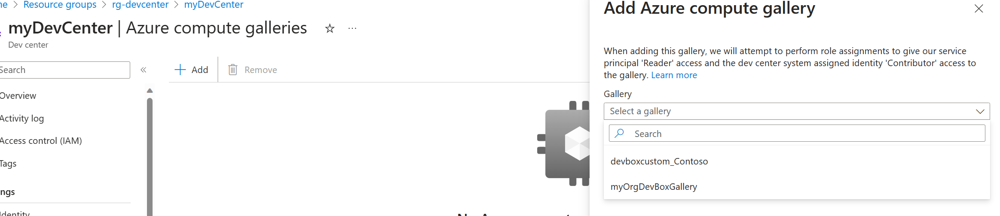
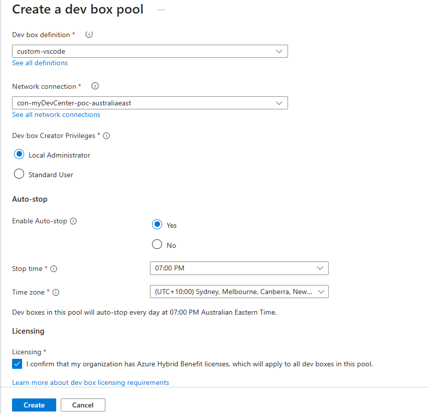
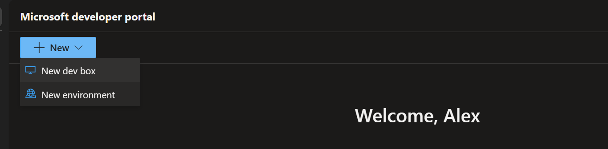
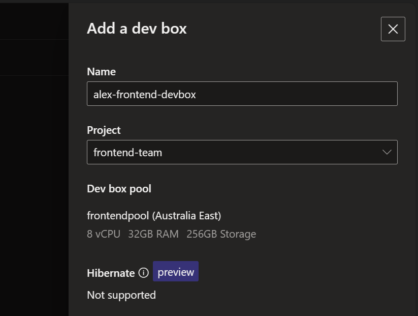
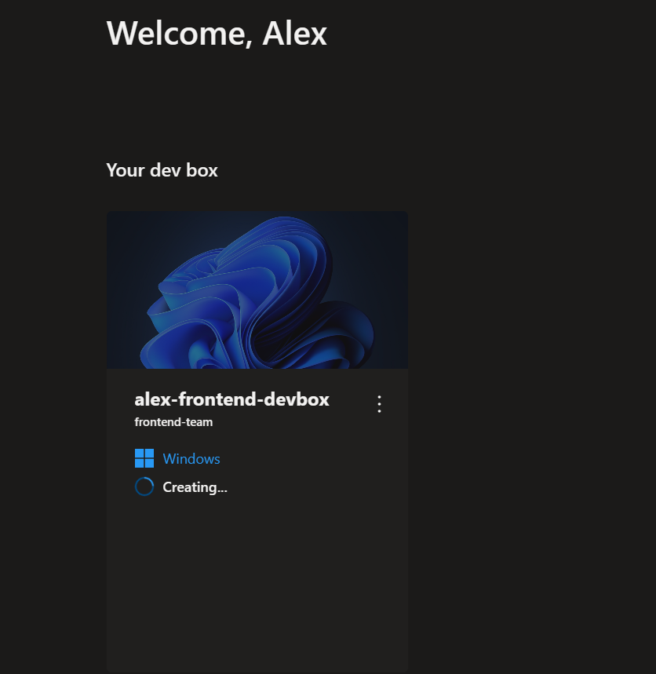
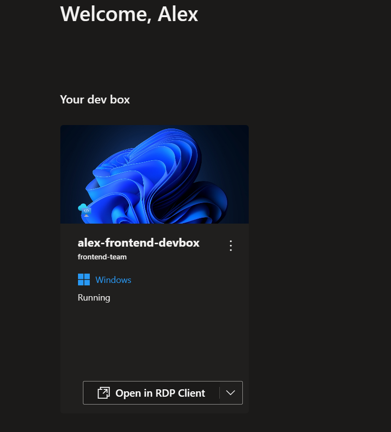
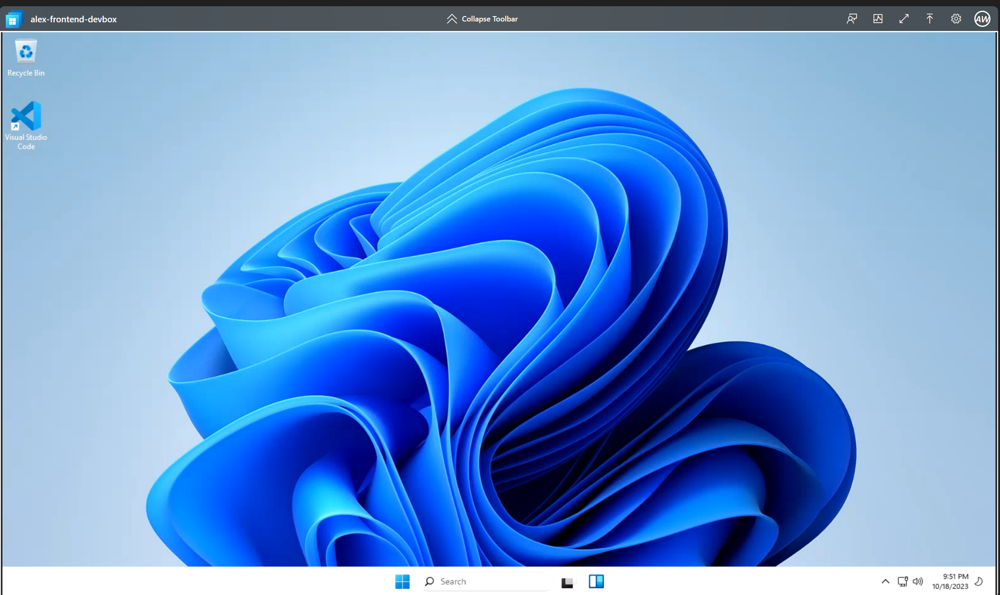

## Microsoft Dev Box Quickstart

- [What is Microsoft Dev Box?](https://learn.microsoft.com/en-us/azure/dev-box/overview-what-is-microsoft-dev-box)
- [DevBox QuickStart](https://github.com/luxu-ms/Devbox-ADE-Infra/tree/main)

# Custom DevBox Image

## Requirements

- Install the AZ CLI tool
- Connect to your Azure tenant using `az login`
- Connect to the appropriate subscription `az account set --subscription $subscriptionID`
- User who has logged in into az cli should have Owner permission as this demo assigns an RBAC role to a managed identity
- Ensure that the correct resource providers are enabled on the subscription [resource provider docs](https://learn.microsoft.com/en-us/azure/dev-box/how-to-customize-devbox-azure-image-builder#create-a-windows-image-and-distribute-it-to-azure-compute-gallery)

## Clone the repository

```bash
git clone https://github.com/shksin/devbox-custom-image
```

## Deploying Azure Resources

## 1. Create Dev Center Core Components

Create following variables. Change the values of the variables below to suit your environment.
```bash
# Resource Group for Dev Center
RG_DC=rg-devcenter-poc
LOCATION=australiaeast

# DevCenter Name and Project Team Name
devCenterName=myDevCenter-poc
projectTeamName=frontend-team
```

Create a resource group in Azure for Microsoft Dev Box Dev Center. 
```bash

#Get the deploying users id for RBAC assignments
DEPLOYINGUSERID=$(az ad signed-in-user show --query id -o tsv)

#Object Ids of the users who will be assigned as DevBoxProjectUsers
devBoxUsers="[\"f425e6e6-667c-4312-bbb2-c7cdb212650b\", \"3a161612-b1fb-4707-a716-bd9ec0cc6d19\"]"

#Create resource group
az group create -n $RG_DC -l $LOCATION

#Create devcenter common components
az deployment group create -g $RG_DC -f modules/devCenter.bicep -p devCenterName=$devCenterName projectTeamName=$projectTeamName devboxProjectAdmin=$DEPLOYINGUSERID devboxProjectUsers="$devBoxUsers"
```

Following resources are created in Dev Center resource group:
- **Dev center:** A collection of Projects that require similar settings. 
- **Project:**  Represents a team or  or business function within the organization.
- **DevBoxProjectAdmin:** The user who is responsible for managing the project. 


## 2. Create Network Connecction for DevBox Definition
Create a resource group in Azure for DevBox Network Connection and Virtual Network. Change the values of the variables below to suit your environment.
```bash

#Create variables

RG_Network=rg-devcenter-network
LOCATION=australiaeast

#Create Resource Group
az group create -n $RG_Network -l $LOCATION

#Create Network Resources
az deployment group create -g $RG_Network -f modules/devboxNetworking.bicep -p prefix=$devCenterName
```

Attach Network Connection to Dev Center

To attach your network connection, select “Networking”, then click “Add network connection” and select the network connection resource that you created in the previous task. Click the “Add” button.


Once the process is complete a status message like the one shown below should appear.

 
The Dev center now knows how to connect new Dev Boxes to your Azure virtual network. 


## 3. Create Custom Image for DevBox

Create a resource group in Azure for Microsoft Dev Box Dev Center. Change the values of the variables below to suit your environment.
```bash

#Create variables

RG_Gallery=rg-devcenter-images
LOCATION=australiaeast

# Compute Gallery Name, Image Name and Image Publisher
computeGalleryName=myOrgDevBoxGallery
imageName=Win11-VSCode-Custom-Image
imagePublisher=myOrganisation

az group create -n $RG_Gallery -l $LOCATION

#Create custom image for VS Code

az deployment group create -g $RG_Gallery -f modules/customImage.bicep  -p computeGalleryName=$computeGalleryName imageName=$imageName imagePublisher=$imagePublisher 
```

<br> **Note:** The Image build process is slow and can take upto 30-45 minutes. <br>
Navigate to the `Image Template` created and check the status of the image build. <br>
     <br>

Once the image build is complete, the status should update to succeeded.<br>
     


Following resources are created in Custom Image resource group:
- **Azure Compute Gallery:** A gallery for Virtual Machine images to be stored and distributed for consumption.
- **VM Image Definition:** The Image definitions that are versioned and publish to the Compute Gallery.
- **Image Template:** Azure Image Builder template used to create a Virtual Machine image that can be used by DevBox.
- **Deployment Script:** Triggers the `image template build` to create a new image.
- **Managed Identity:** The identity used by the Virtual Machine Image definition to spin-up a Virtual Machine, Virtual Network and create an image.

**Note:** Run Step 4 only when Custom Image Build has succeeded in Step 3 above. <br>

## 4. Attach Compute Gallery to Dev Center
1. Navigate to the `Dev Center` created in step 1.
2. On the left menu, select `Azure compute galleries`


3. Select the gallery created in step 3.
 
<br>


## 5. Create DevBox Definition in the Dev Center from the Image Build Created above

1. Navigate to the `Dev Center` created in step 1.
2. On the left menu, select `Dev box definitions` and select the `Create` option in the blade that appears.
4. Select custom image from the gallery created in step 4. 
5. Add dev box definition Name, Image Version, Compute and Storage values and Click on `Create` button.


<br> **Note:** DevBox Definitions are validated when created and it can take upto 20-30 minutes for validation to succeed . <br>
Navigate to the `Dev Box definitions` menu on left and the status should show as `Pending`. <br>
     <br>

After validation is succeeded<br>
     


**Note:** Run Step 6 only when Dev Box Definition has succeeded in Step 4 above. <br>

## 6. Create Dev Pools for the Project

1. Navigate to the `Dev Center`. Selct `Projects` in the left menu and select the project name created in Step 1
2. Inside the project, select `Dev box Pools` in the left menu and select the `Create` option in the blade that appears.
4. Select Dev box definition from the DevBox definition created in Step 5. 
4. Select Network Connection created in Step 2.
5. Provide other values and click on `Create` button.
    

## 7. Create a DevBox
**Note:** This step is completed by the Developer once step 6 is complete <br>

1. log into the Dev Box Portal https://devportal.microsoft.com/
2. Select `New` -> `New Dev Box`
     
3. Select the correct Project Name, Dev Box Pool and specify a name for the Dev Box and click on `Create` button.
     

**Note:** Dev Box creation can take upto 30 mins when you first create it. You will get an email once it is provisioned.
     

Once DevBox is created, log into the Dev Box Portal https://devportal.microsoft.com/ and you should see the DevBox listed.
        


You can connect to DevBox either using RDP client or using browser

 


    


